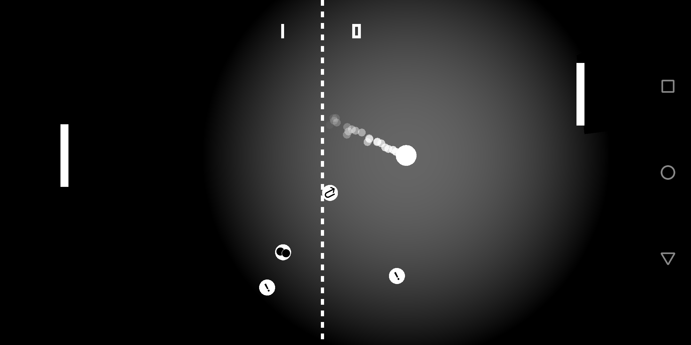

# AndroidPong
A rudimentary clone of the Atari game "Pong" (https://en.wikipedia.org/wiki/Pong) for Android. This game was developed for the course "Multimedia"  in summer semester 2017 at TU Bergakademie Freiberg. It is written in Kotlin using OpenGL ES. 
Authors: Lorenzo Neumann, Johannes Vater

